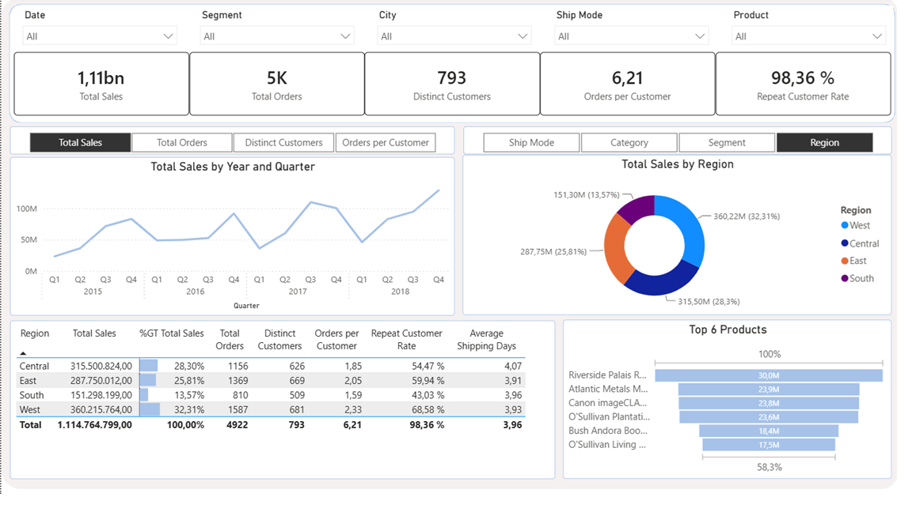
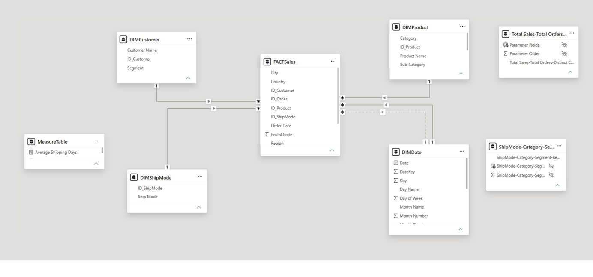

# 📊 Retail Sales Dashboard | Power BI

---

# Overview

The objective of this project was to transform a flat transactional dataset into a well-structured Business Intelligence solution. This involved designing a Star Schema data model, identifying and resolving data quality issues (such as duplicated identifiers and inconsistent records), creating reusable DAX measures, and developing an interactive Power BI dashboard that enables users to explore the data dynamically rather than relying on static reports.

The dashboard was designed as an analytical tool, allowing users to dynamically change both the business metric and the analysis dimension, providing a flexible experience beyond a traditional static report.

---

# Dashboard Preview



---

# Dataset

### Source

- Superstore Sales Dataset (Kaggle)
- https://www.kaggle.com/datasets/rohitsahoo/sales-forecasting/data

### Dataset Information

- Rows: 9800 
- Columns: Row ID | Order ID | Order Date | Ship Date | Ship Mode | Customer ID | Customer Name | Segment | Country | City | State | Postal Code | Region | Product ID | Category | Sub-Category | Product Name | Sales
- Period: 2015-2028
- Country: United States


The dataset contains transactional retail sales records from a fictional US-based superstore between 2015 and 2018. Each row represents a single product sold within an order and includes information about the customer, product, shipping details, geographic location, and sales amount. The data enables the analysis of sales performance across different customer segments, product categories, regions, and shipping methods.

---

# Business Requirements

The primary objective of this dashboard is to provide a flexible analytical tool rather than a static report.

Users can dynamically select both the business metric and the analysis dimension, allowing them to explore the dataset from multiple perspectives without the need for multiple report pages.

The dashboard was designed to answer questions such as:

- Which product category, customer segment, region or shipping mode generates the highest sales?
- How do different KPIs evolve over time?
- Which products contribute the most to total sales?
- How many orders does the average customer place?
- What percentage of customers are repeat customers?
- How long does it take, on average, to ship an order?
- How do business insights change when switching between different metrics and dimensions?

The report focuses on providing an intuitive and interactive user experience, enabling business users to perform ad-hoc analysis with minimal effort.

---

# Data Model




The report was built following a **Star Schema** approach to improve performance, simplify DAX calculations and provide a scalable model.

The model consists of:

- **1 Fact Table** containing transactional sales data.
- **4 Dimension Tables** providing descriptive attributes for Customers, Products, Dates and Shipping information.

Some additional transformations were required during the modeling process, including the creation of a custom Product Key to resolve duplicated Product IDs referring to different products.

---

# Data Preparation

## Cleaning Process

Since the original dataset consisted of a single flat CSV file, the first step was to transform it into a dimensional model suitable for Business Intelligence reporting.

Four potential dimension tables were identified:

- **DIMCustomer**, using the existing Customer ID.
- **DIMProduct**, using a custom Product Key (explained below).
- **DIMShipMode**, generated from the distinct shipping methods.
- **DIMLocation**, combining Country, State, City and Postal Code.

After evaluating the model, **DIMLocation** was intentionally omitted. Implementing it would have required joining the fact table on four different columns, adding unnecessary complexity with limited analytical value. Considering the size of the dataset and the expected use cases, keeping the geographical attributes in the fact table resulted in a simpler and more efficient model.

The final model therefore consists of one fact table and four dimension tables, following a Star Schema design.

---

## Product Key Issue

Explain the duplicated Product ID problem.

Example:

Original Product ID:


Explain your solution.

---

# Measures


Main KPIs:

- Total Sales
- Total Orders
- Distinct Customers
- Orders per Customer
- Repeat Customer Rate
- Average Shipping Days

Explain any interesting measure.

---

# Dynamic Features

Explain:

- Field Parameters
- Dynamic charts
- Dynamic KPIs
- Dynamic titles
- Tooltip (if added)

Include screenshots.

---

# Dashboard Pages

## Executive Overview


Explain the page.

---

## Filters

Explain available filters.

---

## Visualizations

Explain:

- KPI Cards
- Line Chart
- Donut Chart
- Top Products
- Matrix

---

# DAX Examples

Example 1

```DAX
-- Paste measure here
```

Explain what it does.

---

Example 2

```DAX
-- Paste measure here
```

Explain what it does.

---

# Skills Demonstrated

- Data Cleaning
- Data Modeling
- Star Schema Design
- Power Query
- DAX
- Interactive Reporting
- Business Intelligence

---

# What I Learned

Write here:

- Problems you found.
- Decisions you made.
- Things you would improve.
- Lessons learned.

---

# Repository Structure

```text
Retail Sales Dashboard

│
├── Dashboard.pbix
├── Dataset.csv
├── README.md
│
└── Images
    ├── dashboard.png
    ├── data_model.png
    ├── measures.png
    ├── page_overview.png
    └── ...
```

---

# Author

**Ramón García Rico**

Data Analyst

Tokyo, Japan

LinkedIn:
